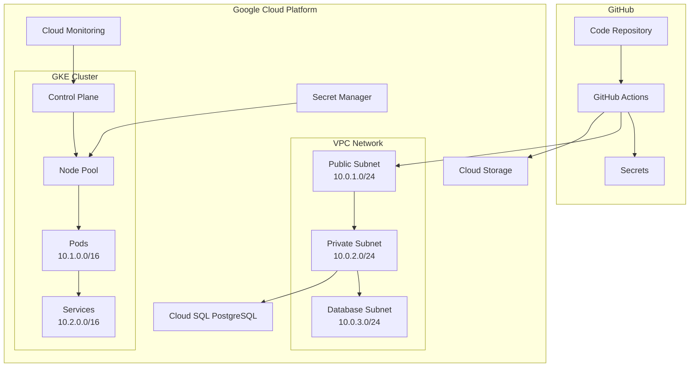

# 🏗️ Pinky Promise Infrastructure

> **Complete Infrastructure-as-Code (IaC) solution for the Pinky Promise application using Terraform, Google Cloud Platform, and GitHub Actions CI/CD**

## 📋 Table of Contents

- [🎯 Overview](#-overview)
- [🏗️ Architecture](#️-architecture)
- [🚀 Quick Start](#-quick-start)
- [📁 Project Structure](#-project-structure)
- [⚙️ Configuration](#️-configuration)
- [🔧 Setup Guide](#-setup-guide)
- [🔄 Workflow Usage](#-workflow-usage)
- [🔐 Secrets Management](#-secrets-management)
- [🛠️ Troubleshooting](#️-troubleshooting)
- [📖 Commands Reference](#-commands-reference)
- [🎛️ Environment Management](#️-environment-management)
- [💰 Cost Management](#-cost-management)
- [🔒 Security](#-security)
- [🚨 Monitoring & Alerts](#-monitoring--alerts)
- [🏆 Best Practices](#-best-practices)
- [❓ FAQ](#-faq)

## 🎯 Overview

This repository contains the complete infrastructure automation for the Pinky Promise application, providing:

- **🌐 Google Kubernetes Engine (GKE)** - Managed Kubernetes cluster with auto-scaling
- **🗄️ Cloud SQL PostgreSQL** - Managed database with high availability and backups
- **🔗 VPC Networking** - Secure, isolated network infrastructure
- **🛡️ Security & IAM** - Comprehensive security controls and identity management
- **📊 Monitoring & Logging** - Complete observability stack
- **⚡ CI/CD Pipeline** - Automated deployment with GitHub Actions
- **🧹 Resource Management** - Conflict detection and cleanup automation

### 🎖️ Key Features

- ✅ **Multi-Environment Support** (Development, Staging, Production)
- ✅ **Infrastructure as Code** with Terraform
- ✅ **Automated CI/CD Pipeline** with GitHub Actions
- ✅ **Resource Conflict Detection** and automated resolution
- ✅ **Cost Estimation** with Infracost integration
- ✅ **Security Scanning** with TFSec and Trivy
- ✅ **State Management** with remote backends
- ✅ **Comprehensive Monitoring** and alerting

## 🏗️ Architecture



### 🏢 Infrastructure Components

| Component | Purpose | Environment | Configuration |
|-----------|---------|-------------|---------------|
| **VPC Network** | Isolated network infrastructure | All | Custom CIDR blocks |
| **GKE Cluster** | Kubernetes orchestration | All | Auto-scaling node pools |
| **Cloud SQL** | PostgreSQL database | All | HA with read replicas |
| **Load Balancers** | Traffic distribution | All | Global HTTP(S) LB |
| **Cloud Storage** | State & artifact storage | All | Multi-regional buckets |
| **Secret Manager** | Secrets & credentials | All | Encrypted storage |
| **Cloud Monitoring** | Observability stack | All | Custom metrics & alerts |
| **IAM & Security** | Access control | All | Least privilege |

## 🚀 Quick Start

### Prerequisites

- 🔑 Google Cloud Platform account with billing enabled
- 🐙 GitHub repository with Actions enabled
- 💻 Local environment with:
  - [Terraform](https://terraform.io/downloads) ≥ 1.6.6
  - [Google Cloud SDK](https://cloud.google.com/sdk/docs/install)
  - [kubectl](https://kubernetes.io/docs/tasks/tools/)

### 🏃‍♂️ 5-Minute Setup

1. **Clone the repository:**
   ```bash
   git clone https://github.com/your-org/pinky-promise-infrastructure.git
   cd pinky-promise-infrastructure
   ```

2. **Configure environment variables:**
   ```bash
   cp terraform/environments/production.tfvars.example terraform/environments/production.tfvars
   # Edit the file with your values
   ```

3. **Set up GitHub secrets** (see [Secrets Management](#-secrets-management))

4. **Deploy infrastructure:**
   - Push to `main` branch for production
   - Push to `develop` branch for staging
   - Use manual workflow dispatch for development

## 📁 Project Structure

```
pinky-promise-infrastructure/
├── 📁 terraform/                    # Terraform configurations
│   ├── 📄 main.tf                  # Main Terraform configuration
│   ├── 📄 variables.tf             # Variable definitions
│   ├── 📄 outputs.tf               # Output definitions
│   ├── 📁 modules/                 # Terraform modules
│   │   ├── 📁 networking/          # VPC and networking
│   │   ├── 📁 gke-cluster/         # Kubernetes cluster
│   │   ├── 📁 database/            # Cloud SQL database
│   │   ├── 📁 security/            # IAM and security
│   │   └── 📁 monitoring/          # Monitoring and logging
│   └── 📁 environments/            # Environment-specific configs
│       ├── 📄 development.tfvars   # Development variables
│       ├── 📄 staging.tfvars       # Staging variables
│       └── 📄 production.tfvars    # Production variables
├── 📁 .github/
│   ├── 📁 workflows/
│   │   └── 📄 infrastructure.yml   # CI/CD pipeline
│   └── 📁 scripts/
│       └── 📄 local-deploy.sh      # Local deployment script
├── 📁 scripts/
│   ├── 📄 check-existing-resources.sh  # Resource conflict detection
│   └── 📄 cleanup-resources.sh        # Resource cleanup
├── 📁 argocd/
│   └── 📁 applications/
│       └── 📄 pinky-promise-app.yaml   # ArgoCD application
└── 📄 README.md                    # This file
```

## ⚙️ Configuration

### 🌍 Environment Variables

Each environment has its own configuration file in `terraform/environments/`:

```hcl
# terraform/environments/production.tfvars
project_id    = "your-gcp-project-id"
region        = "us-central1"
environment   = "production"
cluster_name  = "pinky-promise-cluster"

# Resource sizing
database_tier     = "db-custom-2-4096"  # 2 vCPU, 4GB RAM
min_node_count    = 2
max_node_count    = 10

# Features
enable_monitoring    = true
enable_backup       = true
enable_read_replica = true
enable_high_availability = true

# Security
enable_private_nodes = true
enable_deletion_protection = true

# Networking
vpc_cidr              = "10.0.0.0/16"
public_subnet_cidr    = "10.0.1.0/24"
private_subnet_cidr   = "10.0.2.0/24"
database_subnet_cidr  = "10.0.3.0/24"
pods_cidr            = "10.1.0.0/16"
services_cidr        = "10.2.0.0/16"

# Monitoring
alert_email = "your-email@example.com"
```

### 🔧 Infrastructure Modules

The infrastructure is organized into modular components:

#### 1. **Networking Module** (`terraform/modules/networking/`)
- Creates VPC network with custom subnets
- Configures Cloud NAT for private subnet internet access
- Sets up firewall rules for security
- Manages private service connection for Cloud SQL

#### 2. **GKE Cluster Module** (`terraform/modules/gke-cluster/`)
- Provisions managed Kubernetes cluster
- Configures auto-scaling node pools
- Sets up private nodes with authorized networks
- Enables workload identity and security features

#### 3. **Database Module** (`terraform/modules/database/`)
- Creates Cloud SQL PostgreSQL instance
- Configures high availability and backups
- Sets up read replicas for scaling
- Manages database users and permissions

#### 4. **Security Module** (`terraform/modules/security/`)
- Creates service accounts with minimal permissions
- Configures IAM roles and bindings
- Sets up Secret Manager for credentials
- Manages workload identity bindings

#### 5. **Monitoring Module** (`terraform/modules/monitoring/`)
- Sets up Cloud Monitoring and Logging
- Creates custom metrics and dashboards
- Configures alerting policies
- Enables audit logging and security monitoring

## 🔧 Setup Guide

### 🏗️ Initial Setup

#### 1. Google Cloud Platform Setup

```bash
# Install Google Cloud SDK
curl https://sdk.cloud.google.com | bash
exec -l $SHELL

# Authenticate and set project
gcloud auth login
gcloud config set project YOUR_PROJECT_ID

# Enable required APIs
gcloud services enable \
  container.googleapis.com \
  sqladmin.googleapis.com \
  servicenetworking.googleapis.com \
  secretmanager.googleapis.com \
  monitoring.googleapis.com \
  logging.googleapis.com
```

#### 2. Create Service Account for Terraform

```bash
# Create service account
gcloud iam service-accounts create terraform-automation \
  --display-name="Terraform Automation" \
  --description="Service account for Terraform automation"

# Grant necessary permissions
gcloud projects add-iam-policy-binding YOUR_PROJECT_ID \
  --member="serviceAccount:terraform-automation@YOUR_PROJECT_ID.iam.gserviceaccount.com" \
  --role="roles/editor"

gcloud projects add-iam-policy-binding YOUR_PROJECT_ID \
  --member="serviceAccount:terraform-automation@YOUR_PROJECT_ID.iam.gserviceaccount.com" \
  --role="roles/iam.serviceAccountAdmin"

# Create and download key
gcloud iam service-accounts keys create terraform-key.json \
  --iam-account=terraform-automation@YOUR_PROJECT_ID.iam.gserviceaccount.com
```

#### 3. Create Terraform State Bucket

```bash
# Create bucket for Terraform state
gsutil mb -p YOUR_PROJECT_ID gs://YOUR_PROJECT_ID-terraform-state

# Enable versioning
gsutil versioning set on gs://YOUR_PROJECT_ID-terraform-state
```

### 🔐 GitHub Setup

#### 1. Add Repository Secrets

Go to your GitHub repository → Settings → Secrets and variables → Actions

**Required Secrets:**

| Secret Name | Description | Example Value |
|-------------|-------------|---------------|
| `GCP_SA_KEY` | Service account JSON key | `{"type": "service_account"...}` |
| `DEV_PROJECT_ID` | Development GCP project ID | `pinky-promise-dev` |
| `STAGING_PROJECT_ID` | Staging GCP project ID | `pinky-promise-staging` |
| `PROD_PROJECT_ID` | Production GCP project ID | `pinky-promise-prod` |
| `DEV_TF_STATE_BUCKET` | Dev Terraform state bucket | `pinky-promise-dev-terraform-state` |
| `STAGING_TF_STATE_BUCKET` | Staging state bucket | `pinky-promise-staging-terraform-state` |
| `PROD_TF_STATE_BUCKET` | Prod state bucket | `pinky-promise-prod-terraform-state` |
| `ALERT_EMAIL` | Email for monitoring alerts | `alerts@yourcompany.com` |

#### 2. Configure Environment Files

Create environment-specific configuration files:

```bash
# Development environment
cp terraform/environments/development.tfvars.example terraform/environments/development.tfvars

# Staging environment  
cp terraform/environments/staging.tfvars.example terraform/environments/staging.tfvars

# Production environment
cp terraform/environments/production.tfvars.example terraform/environments/production.tfvars
```

Edit each file with environment-specific values.

## 🔄 Workflow Usage

### 🎯 Workflow Triggers

The CI/CD pipeline is triggered by:

1. **📝 Pull Requests** → Validation and planning
2. **🚀 Push to main** → Production deployment
3. **🚀 Push to develop** → Staging deployment
4. **🎛️ Manual Dispatch** → Custom environment deployment

### 🔄 Workflow Stages

#### 1. **🔍 Validation & Security Scanning**
```yaml
# Automatically triggered on:
# - Pull requests
# - Push to main/develop
# - Manual workflow dispatch

Steps:
- Terraform format check
- Terraform validation
- Security scanning with TFSec
- Infrastructure scanning with Trivy
- Change detection for affected environments
```

#### 2. **📋 Infrastructure Planning**
```yaml
# Creates execution plan and cost estimates

Steps:
- Initialize Terraform with remote state
- Generate detailed execution plan
- Calculate cost estimates with Infracost
- Post plan summary to PR comments
- Upload plan artifacts for apply stage
```

#### 3. **🚀 Infrastructure Deployment**
```yaml
# Applies approved changes to infrastructure

Steps:
- Resource conflict detection
- Apply Terraform plan
- Capture infrastructure outputs
- Configure kubectl access
- Upload deployment artifacts
- Send notifications
```

#### 4. **🧹 Infrastructure Destruction** (Manual Only)
```yaml
# Safely destroys infrastructure when needed

Steps:
- Confirmation requirements
- Terraform destroy with approval
- Cleanup verification
```

### 🎛️ Manual Workflow Dispatch

To manually trigger deployments:

1. Go to **Actions** tab in GitHub
2. Select **🏗️ Infrastructure CI/CD Pipeline**
3. Click **Run workflow**
4. Choose:
   - **Environment**: `development`, `staging`, or `production`
   - **Action**: `plan`, `apply`, or `destroy`

### 📊 Workflow Examples

#### Example 1: Development Deployment
```bash
# Method 1: Push to feature branch
git checkout -b feature/new-infrastructure
git add terraform/
git commit -m "Add new infrastructure component"
git push origin feature/new-infrastructure
# Create PR → Triggers validation and planning

# Method 2: Manual dispatch
# Go to GitHub Actions → Run workflow
# Environment: development
# Action: apply
```

#### Example 2: Production Deployment
```bash
# Merge approved PR to main
git checkout main
git merge feature/new-infrastructure
git push origin main
# Automatically triggers production deployment
```

#### Example 3: Emergency Rollback
```bash
# Manual workflow dispatch
# Environment: production
# Action: destroy
# Then re-deploy previous version
```

## 🔐 Secrets Management

### 🗝️ GitHub Secrets Setup

#### Required Secrets for Each Environment

```bash
# Production Environment
PROD_PROJECT_ID="your-prod-project-id"
PROD_TF_STATE_BUCKET="your-prod-project-id-terraform-state"

# Staging Environment  
STAGING_PROJECT_ID="your-staging-project-id"
STAGING_TF_STATE_BUCKET="your-staging-project-id-terraform-state"

# Development Environment
DEV_PROJECT_ID="your-dev-project-id"
DEV_TF_STATE_BUCKET="your-dev-project-id-terraform-state"

# Global Secrets
GCP_SA_KEY="{...service account JSON key...}"
ALERT_EMAIL="your-alerts@example.com"
```

#### Adding Secrets via GitHub CLI

```bash
# Install GitHub CLI
brew install gh
# or
sudo apt install gh

# Authenticate
gh auth login

# Add secrets
gh secret set GCP_SA_KEY < terraform-key.json
gh secret set PROD_PROJECT_ID --body "your-prod-project-id"
gh secret set ALERT_EMAIL --body "alerts@yourcompany.com"
```

### 🔒 Google Cloud Secret Manager

For application secrets (database passwords, API keys):

```bash
# Create secrets in Secret Manager
gcloud secrets create database-password --data-file=-
# Type password and press Ctrl+D

gcloud secrets create api-key --data-file=-
# Type API key and press Ctrl+D

# Grant access to service accounts
gcloud secrets add-iam-policy-binding database-password \
  --member="serviceAccount:pinky-promise-app@PROJECT_ID.iam.gserviceaccount.com" \
  --role="roles/secretmanager.secretAccessor"
```

### 🔄 Rotating Secrets

```bash
# Rotate service account key
gcloud iam service-accounts keys create new-terraform-key.json \
  --iam-account=terraform-automation@YOUR_PROJECT_ID.iam.gserviceaccount.com

# Update GitHub secret
gh secret set GCP_SA_KEY < new-terraform-key.json

# Delete old key
gcloud iam service-accounts keys delete OLD_KEY_ID \
  --iam-account=terraform-automation@YOUR_PROJECT_ID.iam.gserviceaccount.com
```

## 🛠️ Troubleshooting

### 🚨 Common Issues and Solutions

#### 1. **VPC Already Exists Error**

**Error:**
```
Error: Error creating Network: googleapi: Error 409: The resource 'projects/PROJECT_ID/global/networks/vpc-name' already exists
```

**Solution:**
```bash
# Option 1: Import existing VPC
cd terraform
terraform import module.networking.google_compute_network.vpc "projects/PROJECT_ID/global/networks/vpc-name"

# Option 2: Use cleanup script
./scripts/cleanup-resources.sh production YOUR_PROJECT_ID

# Option 3: Manual deletion
gcloud compute networks delete vpc-name --project=PROJECT_ID
```

#### 2. **Service Account Permissions Error**

**Error:**
```
Error: Error applying IAM policy for service account: googleapi: Error 403: Permission denied
```

**Solution:**
```bash
# Check current permissions
gcloud projects get-iam-policy YOUR_PROJECT_ID

# Add required roles
gcloud projects add-iam-policy-binding YOUR_PROJECT_ID \
  --member="serviceAccount:terraform-automation@YOUR_PROJECT_ID.iam.gserviceaccount.com" \
  --role="roles/iam.serviceAccountAdmin"

gcloud projects add-iam-policy-binding YOUR_PROJECT_ID \
  --member="serviceAccount:terraform-automation@YOUR_PROJECT_ID.iam.gserviceaccount.com" \
  --role="roles/compute.networkAdmin"
```

#### 3. **kubectl Authentication Error**

**Error:**
```
Error: exec plugin: invalid apiVersion "client.authentication.k8s.io/v1alpha1"
```

**Solution:**
```bash
# Install the GKE auth plugin
gcloud components install gke-gcloud-auth-plugin

# Set environment variable
export USE_GKE_GCLOUD_AUTH_PLUGIN=True

# Update kubeconfig
gcloud container clusters get-credentials CLUSTER_NAME \
  --region=REGION --project=PROJECT_ID
```

#### 4. **Terraform State Lock Error**

**Error:**
```
Error: Error acquiring the state lock: state blob is already being modified
```

**Solution:**
```bash
# Force unlock (use with caution)
terraform force-unlock LOCK_ID

# Or wait for concurrent operation to complete
# Check GitHub Actions for running workflows
```

#### 5. **API Not Enabled Error**

**Error:**
```
Error: Error creating instance: googleapi: Error 403: Cloud SQL API has not been used
```

**Solution:**
```bash
# Enable required APIs
gcloud services enable sqladmin.googleapis.com
gcloud services enable container.googleapis.com
gcloud services enable servicenetworking.googleapis.com
gcloud services enable secretmanager.googleapis.com
gcloud services enable monitoring.googleapis.com
```

#### 6. **Database Connection Error**

**Error:**
```
Error: could not connect to database: dial tcp: lookup database-instance.internal on 8.8.8.8:53: no such host
```

**Solution:**
```bash
# Check private service connection
gcloud services vpc-peerings list --service=servicenetworking.googleapis.com

# Verify DNS configuration
gcloud compute networks describe VPC_NAME --project=PROJECT_ID

# Test connection from GKE pod
kubectl run -i --tty debug --image=postgres:13 --restart=Never -- bash
# Inside pod:
psql -h DATABASE_IP -U postgres -d pinky_promise
```

### 🔍 Debugging Terraform Issues

#### Enable Detailed Logging

```bash
# Set debug level
export TF_LOG=DEBUG
export TF_LOG_PATH=terraform-debug.log

# Run terraform command
terraform plan

# Check logs
tail -f terraform-debug.log
```

#### State Inspection

```bash
# List all resources
terraform state list

# Show specific resource
terraform state show 'module.gke-cluster.google_container_cluster.primary'

# Remove resource from state (if needed)
terraform state rm 'resource.name'
```

#### Refresh State

```bash
# Refresh state from actual infrastructure
terraform refresh

# Plan with refresh
terraform plan -refresh=true
```

### 🚨 Emergency Procedures

#### Complete Infrastructure Recovery

```bash
# 1. Backup current state
terraform state pull > backup-state.json

# 2. Clean slate deployment
./scripts/cleanup-resources.sh production YOUR_PROJECT_ID force

# 3. Re-deploy infrastructure
terraform init
terraform plan -var-file="environments/production.tfvars"
terraform apply -var-file="environments/production.tfvars"
```

#### Database Recovery

```bash
# List available backups
gcloud sql backups list --instance=DATABASE_INSTANCE

# Restore from backup
gcloud sql backups restore BACKUP_ID \
  --restore-instance=DATABASE_INSTANCE \
  --backup-instance=DATABASE_INSTANCE
```

#### GKE Cluster Recovery

```bash
# Get cluster credentials
gcloud container clusters get-credentials CLUSTER_NAME \
  --region=REGION --project=PROJECT_ID

# Check cluster status
kubectl get nodes
kubectl get pods --all-namespaces

# Restart deployment if needed
kubectl rollout restart deployment/pinky-promise-app
```

## 📖 Commands Reference

### 🏗️ Terraform Commands

#### Basic Operations

```bash
# Initialize Terraform
terraform init

# Format code
terraform fmt -recursive

# Validate configuration
terraform validate

# Plan changes
terraform plan -var-file="environments/production.tfvars"

# Apply changes
terraform apply -var-file="environments/production.tfvars"

# Destroy infrastructure
terraform destroy -var-file="environments/production.tfvars"
```

#### State Management

```bash
# List resources
terraform state list

# Show resource details
terraform state show 'resource.name'

# Move resource in state
terraform state mv 'old.name' 'new.name'

# Remove resource from state
terraform state rm 'resource.name'

# Import existing resource
terraform import 'resource.name' 'resource-id'
```

#### Advanced Operations

```bash
# Target specific resource
terraform plan -target='module.database'
terraform apply -target='module.database'

# Use different workspace
terraform workspace new development
terraform workspace select production
terraform workspace list

# Generate dependency graph
terraform graph | dot -Tpng > graph.png
```

### ☁️ Google Cloud Commands

#### Project Management

```bash
# List projects
gcloud projects list

# Set default project
gcloud config set project PROJECT_ID

# Get project info
gcloud projects describe PROJECT_ID
```

#### Compute Engine

```bash
# List VPCs
gcloud compute networks list

# Describe VPC
gcloud compute networks describe VPC_NAME

# List subnets
gcloud compute networks subnets list

# List firewall rules
gcloud compute firewall-rules list
```

#### GKE Operations

```bash
# List clusters
gcloud container clusters list

# Get cluster credentials
gcloud container clusters get-credentials CLUSTER_NAME --region=REGION

# Describe cluster
gcloud container clusters describe CLUSTER_NAME --region=REGION

# List node pools
gcloud container node-pools list --cluster=CLUSTER_NAME --region=REGION
```

#### Cloud SQL

```bash
# List instances
gcloud sql instances list

# Describe instance
gcloud sql instances describe INSTANCE_NAME

# List databases
gcloud sql databases list --instance=INSTANCE_NAME

# List backups
gcloud sql backups list --instance=INSTANCE_NAME
```

#### IAM

```bash
# List service accounts
gcloud iam service-accounts list

# Get IAM policy
gcloud projects get-iam-policy PROJECT_ID

# Add IAM binding
gcloud projects add-iam-policy-binding PROJECT_ID \
  --member="user:email@domain.com" \
  --role="roles/viewer"
```

### 🐳 Kubernetes Commands

#### Cluster Information

```bash
# Cluster info
kubectl cluster-info

# Get nodes
kubectl get nodes

# Describe node
kubectl describe node NODE_NAME

# Get namespaces
kubectl get namespaces
```

#### Workload Management

```bash
# Get all resources
kubectl get all --all-namespaces

# Get pods
kubectl get pods -n NAMESPACE

# Describe pod
kubectl describe pod POD_NAME -n NAMESPACE

# Get logs
kubectl logs POD_NAME -n NAMESPACE

# Execute command in pod
kubectl exec -it POD_NAME -n NAMESPACE -- /bin/bash
```

#### Application Deployment

```bash
# Apply manifests
kubectl apply -f kubernetes/

# Delete resources
kubectl delete -f kubernetes/

# Scale deployment
kubectl scale deployment DEPLOYMENT_NAME --replicas=3

# Rolling update
kubectl rollout restart deployment/DEPLOYMENT_NAME

# Rollback
kubectl rollout undo deployment/DEPLOYMENT_NAME
```

### 🔧 Utility Scripts

#### Resource Management

```bash
# Check for existing resources
./scripts/check-existing-resources.sh production YOUR_PROJECT_ID

# Clean up resources
./scripts/cleanup-resources.sh production YOUR_PROJECT_ID

# Force cleanup (no confirmation)
./scripts/cleanup-resources.sh production YOUR_PROJECT_ID force
```

#### Local Development

```bash
# Local deployment script
./.github/scripts/local-deploy.sh

# Validate Terraform locally
terraform fmt -check -recursive terraform/
terraform validate
```

## 🎛️ Environment Management

### 🌍 Environment Strategy

We use a three-tier environment strategy:

| Environment | Purpose | Branch | Auto-Deploy | Protection |
|-------------|---------|--------|-------------|------------|
| **Development** | Feature development | `feature/*` | ❌ Manual | ⚡ Low |
| **Staging** | Integration testing | `develop` | ✅ Auto | 🛡️ Medium |
| **Production** | Live application | `main` | ✅ Auto | 🔒 High |

### 🔄 Environment Promotion

#### Development → Staging

```bash
# 1. Create feature branch
git checkout -b feature/new-infrastructure

# 2. Make changes
# Edit terraform files...

# 3. Test locally
terraform plan -var-file="environments/development.tfvars"

# 4. Create PR
git add .
git commit -m "Add new infrastructure feature"
git push origin feature/new-infrastructure
# Create PR to develop branch

# 5. PR triggers validation
# Review plan in PR comments

# 6. Merge to develop
# Automatically deploys to staging
```

#### Staging → Production

```bash
# 1. Test staging thoroughly
# Verify all functionality works

# 2. Create PR from develop to main
git checkout develop
git pull origin develop
git checkout main
git pull origin main
git merge develop

# 3. Push to main
git push origin main
# Automatically deploys to production
```

### 🔧 Environment Configuration

Each environment has its own configuration file:

#### Development (`terraform/environments/development.tfvars`)

```hcl
# Minimal resources for cost optimization
project_id    = "pinky-promise-dev"
environment   = "development"

# Smaller instances
database_tier     = "db-f1-micro"
min_node_count    = 1
max_node_count    = 3

# Disabled features
enable_read_replica      = false
enable_high_availability = false
enable_deletion_protection = false

# Relaxed security for development
enable_private_nodes = false
authorized_networks = [
  {
    cidr_block   = "0.0.0.0/0"
    display_name = "All networks"
  }
]
```

#### Staging (`terraform/environments/staging.tfvars`)

```hcl
# Production-like setup for testing
project_id    = "pinky-promise-staging"
environment   = "staging"

# Medium-sized instances
database_tier     = "db-custom-1-3840"
min_node_count    = 1
max_node_count    = 5

# Some production features
enable_read_replica      = true
enable_high_availability = false
enable_deletion_protection = false

# Production-like security
enable_private_nodes = true
```

#### Production (`terraform/environments/production.tfvars`)

```hcl
# Full production setup
project_id    = "pinky-promise-prod"
environment   = "production"

# Production-sized instances
database_tier     = "db-custom-2-4096"
min_node_count    = 2
max_node_count    = 10

# All production features
enable_read_replica      = true
enable_high_availability = true
enable_deletion_protection = true

# Maximum security
enable_private_nodes = true
authorized_networks = [
  {
    cidr_block   = "203.0.113.0/24"
    display_name = "Office network"
  },
  {
    cidr_block   = "198.51.100.0/24"
    display_name = "VPN network"
  }
]
```

### 🚀 Environment Deployment

#### Manual Deployment

```bash
# Deploy to specific environment
gh workflow run infrastructure.yml \
  -f environment=development \
  -f action=apply

# Plan only (no changes)
gh workflow run infrastructure.yml \
  -f environment=production \
  -f action=plan

# Emergency destroy
gh workflow run infrastructure.yml \
  -f environment=development \
  -f action=destroy
```

#### Automated Deployment

```bash
# Staging deployment (push to develop)
git checkout develop
git push origin develop

# Production deployment (push to main)
git checkout main
git push origin main
```

## 💰 Cost Management

### 📊 Cost Estimation

The pipeline automatically calculates costs using [Infracost](https://www.infracost.io/):

#### Monthly Cost Estimates

| Environment | Estimated Monthly Cost |
|-------------|------------------------|
| **Development** | ~$50-100 USD |
| **Staging** | ~$150-300 USD |
| **Production** | ~$300-600 USD |

#### Cost Breakdown by Service

| Service | Development | Staging | Production |
|---------|-------------|---------|------------|
| **GKE Cluster** | $75/month | $150/month | $300/month |
| **Cloud SQL** | $25/month | $75/month | $150/month |
| **Load Balancer** | $20/month | $20/month | $20/month |
| **Storage** | $5/month | $15/month | $30/month |
| **Monitoring** | $5/month | $10/month | $20/month |
| **Networking** | $10/month | $15/month | $25/month |

### 💡 Cost Optimization Tips

#### 1. **Right-sizing Resources**

```hcl
# Development - use smaller instances
database_tier = "db-f1-micro"     # $7/month
min_node_count = 1
max_node_count = 2

# Production - optimize for performance
database_tier = "db-custom-2-4096" # $150/month
min_node_count = 2
max_node_count = 10
```

#### 2. **Enable Auto-scaling**

```hcl
# GKE auto-scaling reduces costs during low usage
enable_autoscaling = true
min_node_count = 1
max_node_count = 10

# Use preemptible nodes for non-production
preemptible = true  # 80% cost reduction
```

#### 3. **Optimize Storage**

```hcl
# Use standard storage for development
storage_type = "PD_STANDARD"

# Use SSD for production performance
storage_type = "PD_SSD"

# Enable automated backups cleanup
backup_retention_days = 7  # vs 30 for production
```

#### 4. **Schedule Resources**

```bash
# Development auto-shutdown (save ~60% on compute)
# Using Cloud Scheduler + Cloud Functions
gcloud scheduler jobs create http dev-shutdown \
  --schedule="0 18 * * 1-5" \
  --uri="https://REGION-PROJECT.cloudfunctions.net/shutdown-dev"

gcloud scheduler jobs create http dev-startup \
  --schedule="0 8 * * 1-5" \
  --uri="https://REGION-PROJECT.cloudfunctions.net/startup-dev"
```

### 📈 Cost Monitoring

#### Set up Budget Alerts

```bash
# Create budget with alerts
gcloud billing budgets create \
  --billing-account=BILLING_ACCOUNT_ID \
  --display-name="Pinky Promise Budget" \
  --budget-amount=500 \
  --threshold-rules=percent-of-budget=0.5,spend-basis=current-spend \
  --threshold-rules=percent-of-budget=0.9,spend-basis=current-spend \
  --all-projects
```

#### Cost Analysis Queries

```sql
-- BigQuery cost analysis
SELECT 
  service.description as service,
  SUM(cost) as total_cost,
  SUM(usage.amount) as usage_amount,
  usage.unit as usage_unit
FROM `PROJECT.cloud_billing_export.gcp_billing_export_v1_BILLING_ACCOUNT_ID`
WHERE _PARTITIONTIME >= TIMESTAMP_SUB(CURRENT_TIMESTAMP(), INTERVAL 30 DAY)
GROUP BY service.description, usage.unit
ORDER BY total_cost DESC;
```

## 🔒 Security

### 🛡️ Security Architecture

#### Network Security

```hcl
# Private GKE nodes (no public IPs)
enable_private_nodes = true
master_ipv4_cidr_block = "172.16.0.0/28"

# Authorized networks for cluster access
authorized_networks = [
  {
    cidr_block   = "203.0.113.0/24"
    display_name = "Office network"
  }
]

# Firewall rules - deny all by default
default_rules = {
  deny_all_ingress = true
  allow_internal   = true
}
```

#### Identity and Access Management

```hcl
# Service accounts with minimal permissions
resource "google_service_account" "app" {
  account_id   = "pinky-promise-app"
  display_name = "Pinky Promise Application"
}

# Workload Identity binding
resource "google_service_account_iam_binding" "workload_identity" {
  service_account_id = google_service_account.app.name
  role               = "roles/iam.workloadIdentityUser"
  
  members = [
    "serviceAccount:${var.project_id}.svc.id.goog[default/pinky-promise]"
  ]
}
```

#### Data Encryption

```hcl
# Database encryption at rest
encryption_key_name = google_kms_crypto_key.database.id

# Disk encryption
disk_encryption_key = google_kms_crypto_key.disk.id

# Secret Manager for sensitive data
resource "google_secret_manager_secret" "database_password" {
  secret_id = "database-password"
  
  replication {
    automatic = true
  }
}
```

### 🔍 Security Scanning

The pipeline includes automated security scanning:

#### 1. **Terraform Security (TFSec)**

```yaml
- name: 🛡️ Security Scan with TFSec
  uses: aquasecurity/tfsec-action@v1.0.3
  with:
    working_directory: terraform
    soft_fail: true
```

#### 2. **Infrastructure Security (Trivy)**

```yaml
- name: 🛡️ Security Scan with Trivy
  uses: aquasecurity/trivy-action@master
  with:
    scan-type: 'config'
    scan-ref: 'terraform/'
    format: 'sarif'
    output: 'trivy-results.sarif'
```

### 🔐 Security Best Practices

#### 1. **Principle of Least Privilege**

```bash
# Create role with minimal permissions
gcloud iam roles create pinkyPromiseApp \
  --project=PROJECT_ID \
  --title="Pinky Promise App" \
  --description="Minimal permissions for app" \
  --permissions="cloudsql.instances.connect,secretmanager.versions.access"
```

#### 2. **Regular Security Updates**

```bash
# Enable GKE auto-upgrade
enable_auto_upgrade = true
enable_auto_repair  = true

# Use latest GKE version
min_master_version = "latest"
node_version      = "latest"
```

#### 3. **Audit Logging**

```hcl
# Enable audit logs
audit_config {
  service = "allServices"
  audit_log_configs {
    log_type = "ADMIN_READ"
  }
  audit_log_configs {
    log_type = "DATA_READ"
  }
  audit_log_configs {
    log_type = "DATA_WRITE"
  }
}
```

#### 4. **Network Policies**

```yaml
# Kubernetes Network Policy
apiVersion: networking.k8s.io/v1
kind: NetworkPolicy
metadata:
  name: pinky-promise-network-policy
spec:
  podSelector:
    matchLabels:
      app: pinky-promise
  policyTypes:
  - Ingress
  - Egress
  ingress:
  - from:
    - podSelector:
        matchLabels:
          app: frontend
    ports:
    - protocol: TCP
      port: 8080
  egress:
  - to:
    - podSelector:
        matchLabels:
          app: database
    ports:
    - protocol: TCP
      port: 5432
```

### 🚨 Security Incident Response

#### 1. **Immediate Response**

```bash
# Isolate compromised resources
gcloud compute instances stop INSTANCE_NAME

# Revoke service account access
gcloud iam service-accounts disable SERVICE_ACCOUNT_EMAIL

# Block suspicious IPs
gcloud compute firewall-rules create block-suspicious-ip \
  --action=DENY \
  --rules=tcp,udp,icmp \
  --source-ranges=SUSPICIOUS_IP/32
```

#### 2. **Investigation**

```bash
# Check audit logs
gcloud logging read 'protoPayload.authenticationInfo.principalEmail="suspicious@example.com"' \
  --limit=50 \
  --format="table(timestamp,protoPayload.methodName,protoPayload.authenticationInfo.principalEmail)"

# Check access logs
kubectl logs -l app=pinky-promise --since=1h
```

#### 3. **Recovery**

```bash
# Rotate secrets
gcloud secrets versions add database-password --data-file=new-password.txt

# Update application
kubectl rollout restart deployment/pinky-promise

# Verify security
./scripts/security-check.sh production
```

## 🚨 Monitoring & Alerts

### 📊 Monitoring Stack

The infrastructure includes comprehensive monitoring:

#### 1. **Infrastructure Monitoring**

```hcl
# Cloud Monitoring workspace
resource "google_monitoring_workspace" "primary" {
  provider = google-beta
  project  = var.project_id
}

# Custom metrics
resource "google_monitoring_metric_descriptor" "app_requests" {
  description  = "Application request count"
  display_name = "App Requests"
  type         = "custom.googleapis.com/app/requests"
  metric_kind  = "CUMULATIVE"
  value_type   = "INT64"
}
```

#### 2. **Alert Policies**

```hcl
# High CPU alert
resource "google_monitoring_alert_policy" "high_cpu" {
  display_name = "High CPU Usage"
  combiner     = "OR"
  
  conditions {
    display_name = "CPU usage above 80%"
    
    condition_threshold {
      filter          = "resource.type=\"k8s_container\""
      duration        = "300s"
      comparison      = "COMPARISON_GREATER_THAN"
      threshold_value = 0.8
      
      aggregations {
        alignment_period   = "60s"
        per_series_aligner = "ALIGN_RATE"
      }
    }
  }
  
  notification_channels = [google_monitoring_notification_channel.email.name]
}
```

#### 3. **Notification Channels**

```hcl
# Email notifications
resource "google_monitoring_notification_channel" "email" {
  display_name = "Email Alerts"
  type         = "email"
  
  labels = {
    email_address = var.alert_email
  }
}

# Slack notifications
resource "google_monitoring_notification_channel" "slack" {
  display_name = "Slack Alerts"
  type         = "slack"
  
  labels = {
    url = var.slack_webhook_url
  }
}
```

### 📈 Key Metrics to Monitor

| Metric | Threshold | Alert Level |
|--------|-----------|-------------|
| **CPU Usage** | > 80% | Warning |
| **Memory Usage** | > 85% | Warning |
| **Disk Usage** | > 90% | Critical |
| **Database Connections** | > 80% max | Warning |
| **Application Errors** | > 5% error rate | Critical |
| **Response Time** | > 2 seconds | Warning |
| **Pod Restart Count** | > 5 in 1 hour | Warning |
| **Node Count** | < 2 nodes | Critical |

### 🔍 Monitoring Commands

#### Cloud Monitoring

```bash
# List alert policies
gcloud alpha monitoring policies list

# Create alert policy
gcloud alpha monitoring policies create --policy-from-file=alert-policy.yaml

# List notification channels
gcloud alpha monitoring channels list

# Get metrics
gcloud monitoring metrics list
```

#### Kubernetes Monitoring

```bash
# Get cluster metrics
kubectl top nodes
kubectl top pods

# Get resource usage
kubectl describe node NODE_NAME
kubectl describe pod POD_NAME

# Check events
kubectl get events --sort-by=.metadata.creationTimestamp
```

#### Application Monitoring

```bash
# Application logs
kubectl logs -l app=pinky-promise --tail=100

# Follow logs
kubectl logs -f deployment/pinky-promise

# Get application metrics
curl http://pinky-promise-service/metrics
```

### 📊 Dashboards

#### Grafana Dashboard URLs

```bash
# Infrastructure Overview
https://monitoring.example.com/d/infrastructure/infrastructure-overview

# Application Metrics
https://monitoring.example.com/d/application/application-metrics

# Database Performance
https://monitoring.example.com/d/database/database-performance
```

#### Custom Dashboards

```json
{
  "dashboard": {
    "title": "Pinky Promise Infrastructure",
    "panels": [
      {
        "title": "CPU Usage",
        "type": "graph",
        "targets": [
          {
            "expr": "rate(container_cpu_usage_seconds_total[5m])",
            "legendFormat": "{{pod}}"
          }
        ]
      }
    ]
  }
}
```

## 🏆 Best Practices

### 🎯 Infrastructure as Code

#### 1. **Version Control Everything**

```bash
# All infrastructure code in Git
git add terraform/
git commit -m "feat: add monitoring module"

# Tag releases
git tag -a v1.0.0 -m "Production release v1.0.0"
git push origin v1.0.0
```

#### 2. **Modular Design**

```hcl
# Use modules for reusability
module "networking" {
  source = "./modules/networking"
  
  project_id  = var.project_id
  environment = var.environment
  vpc_cidr    = var.vpc_cidr
}

module "gke_cluster" {
  source = "./modules/gke-cluster"
  
  depends_on = [module.networking]
  
  project_id     = var.project_id
  network        = module.networking.network_name
  subnet         = module.networking.private_subnet_name
}
```

#### 3. **Environment Consistency**

```hcl
# Use same module across environments
module "database" {
  source = "./modules/database"
  
  # Environment-specific variables
  instance_tier = var.environment == "production" ? "db-custom-2-4096" : "db-f1-micro"
  ha_enabled   = var.environment == "production" ? true : false
}
```

### 🔄 CI/CD Best Practices

#### 1. **Pipeline as Code**

```yaml
# Store pipeline configuration in code
# .github/workflows/infrastructure.yml
# Version controlled and reviewed
```

#### 2. **Progressive Deployment**

```bash
# Deploy to environments in order
# 1. Development (manual)
# 2. Staging (auto on develop)
# 3. Production (auto on main)
```

#### 3. **Automated Testing**

```yaml
# Include testing in pipeline
- name: Test Infrastructure
  run: |
    terraform validate
    terraform plan -detailed-exitcode
    tflint
    checkov -f terraform/
```

### 🛡️ Security Best Practices

#### 1. **Least Privilege Access**

```bash
# Grant minimal required permissions
gcloud projects add-iam-policy-binding PROJECT_ID \
  --member="serviceAccount:app@PROJECT_ID.iam.gserviceaccount.com" \
  --role="roles/cloudsql.client"  # Not cloudsql.admin
```

#### 2. **Secrets Management**

```bash
# Use Secret Manager, not environment variables
gcloud secrets create api-key --data-file=key.txt

# Rotate secrets regularly
gcloud scheduler jobs create http rotate-secrets \
  --schedule="0 2 1 * *" \
  --uri="https://REGION-PROJECT.cloudfunctions.net/rotate-secrets"
```

#### 3. **Network Security**

```hcl
# Private clusters only
enable_private_nodes = true

# Restrict authorized networks
authorized_networks = [
  {
    cidr_block   = "10.0.0.0/8"  # Internal only
    display_name = "Internal network"
  }
]
```

### 💰 Cost Optimization

#### 1. **Right-sizing**

```bash
# Monitor and adjust resource sizes
gcloud monitoring metrics list --filter="metric.type:cpu"

# Use recommendations
gcloud recommender recommendations list \
  --project=PROJECT_ID \
  --recommender=google.compute.instance.MachineTypeRecommender
```

#### 2. **Auto-scaling**

```hcl
# Enable cluster auto-scaling
cluster_autoscaling {
  enabled         = true
  min_node_count  = 1
  max_node_count  = 10
}

# Use preemptible nodes for non-production
preemptible = var.environment != "production"
```

#### 3. **Resource Lifecycle**

```bash
# Automatic cleanup of old resources
gcloud compute images delete-old \
  --keep-n=5 \
  --filter="family=custom-image"

# Schedule shutdown for development
# Use Cloud Scheduler + Cloud Functions
```

### 📊 Monitoring Best Practices

#### 1. **Comprehensive Monitoring**

```yaml
# Monitor the 4 golden signals
# 1. Latency
# 2. Traffic
# 3. Errors
# 4. Saturation

# Plus infrastructure metrics
# - CPU/Memory usage
# - Disk space
# - Network I/O
```

#### 2. **Meaningful Alerts**

```bash
# Alert on symptoms, not causes
# Good: "Application response time > 2s"
# Bad:  "CPU usage > 80%"

# Include context in alerts
# - Environment
# - Severity
# - Runbook links
```

#### 3. **Alert Fatigue Prevention**

```hcl
# Use appropriate thresholds
threshold_value = 0.8  # 80%, not 50%

# Include duration
duration = "300s"  # 5 minutes, not 30 seconds

# Use notification policies
notification_rate_limit {
  period = "300s"  # Limit to once per 5 minutes
}
```

## ❓ FAQ

### 🤔 General Questions

**Q: How much does this infrastructure cost per month?**

A: Costs vary by environment:
- Development: ~$50-100/month
- Staging: ~$150-300/month  
- Production: ~$300-600/month

See [Cost Management](#-cost-management) for detailed breakdown.

**Q: How long does deployment take?**

A: Typical deployment times:
- Plan: 2-5 minutes
- Apply: 15-30 minutes
- Complete infrastructure: 30-45 minutes

**Q: Can I use this for multiple applications?**

A: Yes! Modify the variable files and module configurations. Consider:
- Separate state files per application
- Shared VPC with separate subnets
- Different namespaces in the same cluster

### 🔧 Technical Questions

**Q: Why is my Terraform apply failing with "already exists" error?**

A: This happens when resources exist outside Terraform state. Solutions:
1. Use `./scripts/check-existing-resources.sh` to detect conflicts
2. Import existing resources: `terraform import resource.name resource-id`
3. Clean up with `./scripts/cleanup-resources.sh`

**Q: How do I add a new environment?**

A: 
1. Create `terraform/environments/NEW_ENV.tfvars`
2. Add GitHub secrets for the new environment
3. Update workflow environment detection logic
4. Create corresponding GCP project

**Q: How do I update the database schema?**

A: Database schema is managed by the application, not infrastructure:
1. Use database migration tools in your app
2. Connect via Cloud SQL Proxy for direct access
3. Never modify schema through Terraform

**Q: Can I use a different cloud provider?**

A: This infrastructure is Google Cloud specific. For other providers:
- AWS: Modify to use EKS, RDS, VPC
- Azure: Use AKS, Azure Database, Virtual Network
- Consider multi-cloud tools like Pulumi or CDK

### 🚨 Troubleshooting Questions

**Q: My workflow is failing on kubectl commands. What's wrong?**

A: Common kubectl issues:
1. Missing GKE auth plugin - install with `gcloud components install gke-gcloud-auth-plugin`
2. Wrong credentials - run `gcloud container clusters get-credentials`
3. Cluster not ready - wait 30-60 seconds after creation

**Q: How do I recover from a corrupted Terraform state?**

A:
```bash
# 1. Backup current state
terraform state pull > backup-state.json

# 2. Try to refresh
terraform refresh

# 3. If corrupted, restore from backup
# Download from Cloud Storage
gsutil cp gs://BUCKET/terraform/ENV/default.tfstate .
terraform state push default.tfstate
```

**Q: Database connection is failing from pods. How to debug?**

A:
```bash
# 1. Check private service connection
gcloud services vpc-peerings list --service=servicenetworking.googleapis.com

# 2. Test DNS resolution from pod
kubectl run -i --tty debug --image=busybox --restart=Never -- nslookup DATABASE_IP

# 3. Check database logs
gcloud sql instances describe INSTANCE_NAME
```

### 🔒 Security Questions

**Q: How do I rotate the service account key?**

A:
```bash
# 1. Create new key
gcloud iam service-accounts keys create new-key.json \
  --iam-account=terraform-automation@PROJECT.iam.gserviceaccount.com

# 2. Update GitHub secret
gh secret set GCP_SA_KEY < new-key.json

# 3. Test deployment
# 4. Delete old key
gcloud iam service-accounts keys delete OLD_KEY_ID \
  --iam-account=terraform-automation@PROJECT.iam.gserviceaccount.com
```

**Q: How do I enable audit logging?**

A: Audit logging is enabled by default in the security module. To customize:
```hcl
audit_config {
  service = "allServices"
  audit_log_configs {
    log_type = "ADMIN_READ"
  }
}
```

**Q: How do I implement network policies?**

A: Network policies are application-level. Deploy them with your app:
```yaml
apiVersion: networking.k8s.io/v1
kind: NetworkPolicy
metadata:
  name: app-network-policy
spec:
  podSelector:
    matchLabels:
      app: pinky-promise
  # ... policy rules
```

---

## 📞 Support

For additional support:

- 📧 **Email**: infrastructure@yourcompany.com
- 💬 **Slack**: #infrastructure-support
- 📖 **Documentation**: [Internal Wiki](https://wiki.yourcompany.com/infrastructure)
- 🐛 **Issues**: [GitHub Issues](https://github.com/your-org/pinky-promise-infrastructure/issues)

---

**📝 Last Updated**: 2024-06-08  
**📋 Version**: 1.0.0  
**👤 Maintainer**: DevOps Team  

---

*This documentation is maintained automatically. For updates, please submit a PR to this repository.*

# Pinky Promise Infrastructure v1.0

🏗️ **Complete GCP Infrastructure for Pinky Promise Application**

## 🚀 Version 1.0 Features

### Infrastructure Components
- **GKE Cluster**: Managed Kubernetes cluster with auto-scaling
- **Cloud SQL**: PostgreSQL database with read replicas (production)
- **VPC Networking**: Secure private networking with subnets
- **Security**: Private nodes, authorized networks, and IAM
- **Monitoring**: Cloud monitoring and logging integration
- **Backup**: Automated database backups with retention

### Environments
- **Development**: Minimal resources for cost optimization
- **Staging**: Production-like environment for testing
- **Production**: High-availability, secure, and scalable

### CI/CD Pipeline
- ✅ Terraform validation and formatting
- ✅ Security scanning with TFSec and Trivy
- ✅ Infrastructure planning with cost estimation
- ✅ Automated deployment on main branch
- ✅ Manual destroy capability for cleanup

This repository contains the infrastructure as code (IaC) for the Pinky Promise application using Terraform and ArgoCD configurations.....

## Repository Structure

```
.
├── terraform/                 # Terraform infrastructure code
│   ├── main.tf               # Main Terraform configuration
│   ├── variables.tf          # Variable definitions
│   ├── outputs.tf            # Output definitions
│   ├── terraform.tfvars.example # Example variables file
│   └── modules/              # Terraform modules
│       ├── networking/       # VPC, subnets, firewall rules
│       ├── gke-cluster/      # GKE cluster configuration
│       ├── database/         # Cloud SQL configuration
│       ├── security/         # IAM, service accounts, secrets
│       └── monitoring/       # Cloud Monitoring setup
├── argocd/                   # ArgoCD configurations
│   └── applications/         # ArgoCD application definitions
└── README.md                 # This file
```

## 🔧 Resource Management Scripts

This repository includes helper scripts to manage resources and handle conflicts:

### Check for Existing Resources
```bash
# Check for existing resources in your GCP project
./scripts/check-existing-resources.sh <environment> <project_id>
```

### Import Existing Resources
```bash
# Import existing resources into Terraform state
./scripts/import-existing-resources.sh <environment> <project_id> [resource_type]
# Resource types: vpc, subnets, cluster, database, all
```

### Clean Up Resources
```bash
# Safely remove all resources (useful for fresh deployments)
./scripts/cleanup-resources.sh <environment> <project_id> [force]
```

### Example Usage
```bash
# Check for conflicts before deployment
./scripts/check-existing-resources.sh production my-gcp-project

# Import existing VPC if needed
./scripts/import-existing-resources.sh production my-gcp-project vpc

# Clean everything for fresh start
./scripts/cleanup-resources.sh production my-gcp-project
```

## Prerequisites

1. **Google Cloud Platform Account**
   - Active GCP project
   - Billing enabled
   - Required APIs enabled (will be enabled by Terraform)

2. **Tools Installation**
   ```bash
   # Install Terraform
   brew install terraform
   
   # Install Google Cloud SDK
   brew install google-cloud-sdk
   
   # Install kubectl
   brew install kubectl
   ```

3. **Authentication**
   ```bash
   # Authenticate with Google Cloud
   gcloud auth login
   gcloud auth application-default login
   
   # Set your project
   gcloud config set project YOUR_PROJECT_ID
   ```

## Deployment Steps

### 1. Infrastructure Deployment

1. **Clone and Configure**
   ```bash
   git clone <this-repo>
   cd pinky-promise-infrastructure
   ```

2. **Configure Variables**
   ```bash
   cp terraform.tfvars.example terraform.tfvars
   # Edit terraform.tfvars with your values
   ```

3. **Deploy Infrastructure**
   ```bash
   terraform init
   terraform plan
   terraform apply
   ```

### 2. ArgoCD Setup

1. **Get GKE Credentials**
   ```bash
   # Use the output from terraform apply
   gcloud container clusters get-credentials <cluster-name> --region <region> --project <project-id>
   ```

2. **Install ArgoCD**
   ```bash
   kubectl create namespace argocd
   kubectl apply -n argocd -f https://raw.githubusercontent.com/argoproj/argo-cd/stable/manifests/install.yaml
   ```

3. **Access ArgoCD UI**
   ```bash
   # Port forward to access ArgoCD UI
   kubectl port-forward svc/argocd-server -n argocd 8080:443
   
   # Get initial admin password
   kubectl -n argocd get secret argocd-initial-admin-secret -o jsonpath="{.data.password}" | base64 -d
   ```

4. **Deploy Applications**
   ```bash
   kubectl apply -f argocd/applications/
   ```

## Key Features

### Infrastructure Components

- **Networking**: VPC with public/private subnets, NAT gateway, firewall rules
- **GKE Cluster**: Autopilot cluster with Workload Identity enabled
- **Database**: Cloud SQL PostgreSQL with private networking
- **Security**: Service accounts, IAM roles, Secret Manager integration
- **Monitoring**: Cloud Monitoring with alerts and dashboards

### GitOps with ArgoCD

- **Automated Deployment**: ArgoCD monitors the application repository
- **Self-Healing**: Automatic drift detection and correction
- **Multi-Environment**: Support for development, staging, and production

## Security Best Practices

- ✅ Private GKE nodes
- ✅ Private database instances
- ✅ Workload Identity for secure pod-to-GCP authentication
- ✅ Secret Manager for sensitive data
- ✅ Least privilege IAM roles
- ✅ Network segmentation with firewall rules

## Monitoring & Observability

- **Metrics**: Cloud Monitoring integration
- **Logging**: Structured logging with Cloud Logging
- **Alerting**: Email notifications for critical events
- **Dashboards**: Pre-configured monitoring dashboards

## Troubleshooting

### Common Issues

1. **API Not Enabled Error**
   ```bash
   # Enable required APIs manually if needed
   gcloud services enable compute.googleapis.com
   gcloud services enable container.googleapis.com
   gcloud services enable servicenetworking.googleapis.com
   ```

2. **Terraform State Issues**
   ```bash
   # Refresh state if resources exist but Terraform doesn't know about them
   terraform refresh
   ```

3. **ArgoCD Application Sync Issues**
   - Check application repository URL is correct
   - Verify target path exists in the app repository
   - Ensure ArgoCD has access to the repository

## Repository Links

- **Infrastructure Repository**: This repository
- **Application Repository**: [pinky-promise-app](../pinky-promise-app)

## Contributing

1. Create a feature branch
2. Make your changes
3. Test thoroughly
4. Submit a pull request

## Cleanup

To destroy all infrastructure:

```bash
terraform destroy
```

**Note**: This will delete all resources including databases. Make sure to backup any important data first.

# Pinky Promise App - Phase 1 Infrastructure

This directory contains the Terraform configuration for deploying the Phase 1 infrastructure foundation for the Pinky Promise application on Google Cloud Platform using GKE Autopilot.

## 🏗️ Architecture Overview

The infrastructure includes:

- **GKE Autopilot Cluster**: Fully managed Kubernetes cluster
- **VPC Network**: Custom VPC with public, private, and database subnets
- **Cloud SQL**: PostgreSQL database with high availability and read replica
- **Secret Manager**: Centralized secret storage
- **IAM & Security**: Service accounts and Workload Identity
- **Monitoring**: Cloud Monitoring with dashboards and alerts

## 📋 Prerequisites

1. **Google Cloud Account** with billing enabled
2. **Google Cloud Project** created
3. **gcloud CLI** installed and configured
4. **Terraform** (>= 1.0) installed
5. **kubectl** installed

## 🚀 Quick Deployment

### 1. Configure Variables

```bash
# Copy the example variables file
cp terraform.tfvars.example terraform.tfvars

# Edit with your project details
vim terraform.tfvars
```

Update the following required variables:
- `project_id`: Your GCP project ID
- `region`: Your preferred GCP region
- `alert_email`: Email for monitoring alerts (in modules/monitoring/variables.tf)

### 2. Deploy Infrastructure

```bash
# Make the deployment script executable
chmod +x deploy.sh

# Run the deployment
./deploy.sh
```

The script will:
1. ✅ Check prerequisites
2. 🔐 Verify authentication
3. 🔧 Enable required APIs
4. 🏗️ Deploy infrastructure with Terraform
5. ⚙️ Configure kubectl
6. ✅ Verify deployment

### 3. Manual Deployment (Alternative)

If you prefer manual deployment:

```bash
# Initialize Terraform
terraform init

# Review the plan
terraform plan

# Apply the configuration
terraform apply

# Configure kubectl
gcloud container clusters get-credentials $(terraform output -raw cluster_name) \
  --region $(terraform output -raw region) \
  --project $(terraform output -raw project_id)
```

## 📊 Post-Deployment

### Verify Deployment

```bash
# Check cluster status
kubectl cluster-info

# View nodes
kubectl get nodes

# List namespaces
kubectl get namespaces

# View all terraform outputs
terraform output
```

### Access Monitoring

```bash
# Get monitoring dashboard URL
terraform output monitoring_dashboard_url
```

### Check Secrets

```bash
# List created secrets
gcloud secrets list --filter="labels.environment=production"
```

## 🔧 Configuration Details

### Network Configuration

- **VPC CIDR**: 10.0.0.0/16
- **Public Subnet**: 10.0.1.0/24 (Load balancer, NAT)
- **Private Subnet**: 10.0.2.0/24 (GKE nodes)
- **Database Subnet**: 10.0.3.0/24 (Cloud SQL)
- **Pod CIDR**: 10.1.0.0/16
- **Service CIDR**: 10.2.0.0/16

### Security Features

- ✅ Private GKE nodes
- ✅ Workload Identity enabled
- ✅ Network policies enabled
- ✅ Secret Manager integration
- ✅ Private Cloud SQL
- ✅ SSL/TLS encryption

### Database Configuration

- **Engine**: PostgreSQL 14
- **Tier**: db-custom-2-4096 (2 vCPU, 4GB RAM)
- **High Availability**: Regional
- **Backups**: Daily with 30-day retention
- **Read Replica**: Enabled

## 🗂️ Module Structure

```
terraform/
├── main.tf                 # Main configuration
├── variables.tf            # Input variables
├── outputs.tf              # Output values
├── terraform.tfvars        # Variable values (create from .example)
└── modules/
    ├── networking/         # VPC, subnets, firewall
    ├── gke-cluster/        # GKE Autopilot cluster
    ├── database/           # Cloud SQL PostgreSQL
    ├── security/           # IAM, secrets, service accounts
    └── monitoring/         # Monitoring and alerting
```

## 🔍 Troubleshooting

### Common Issues

1. **API Not Enabled**
   ```bash
   # Enable required APIs
   gcloud services enable container.googleapis.com compute.googleapis.com
   ```

2. **Insufficient Permissions**
   ```bash
   # Check your permissions
   gcloud projects get-iam-policy YOUR_PROJECT_ID
   ```

3. **Quota Exceeded**
   ```bash
   # Check quotas
   gcloud compute project-info describe --project=YOUR_PROJECT_ID
   ```

4. **kubectl Access Issues**
   ```bash
   # Re-configure kubectl
   gcloud container clusters get-credentials CLUSTER_NAME --region REGION
   ```

### Debug Commands

```bash
# View terraform state
terraform state list

# Check specific resource
terraform state show google_container_cluster.primary

# View logs
kubectl logs -n kube-system -l k8s-app=metrics-server

# Check cluster events
kubectl get events --all-namespaces --sort-by='.lastTimestamp'
```

## 💰 Cost Optimization

- **GKE Autopilot**: Pay only for running pods
- **Cloud SQL**: Consider smaller tiers for dev/staging
- **Persistent Disks**: Use standard disks for non-critical data
- **Regional vs Zonal**: Use zonal for cost savings in non-prod

## 🔄 Next Steps (Phase 2)

After Phase 1 completion:

1. **Application Deployment**: Deploy your Node.js and React applications
2. **Ingress Setup**: Configure NGINX Ingress and SSL certificates
3. **CI/CD Pipeline**: Set up GitHub Actions for automated deployments
4. **Helm Charts**: Package applications for easier management

## 📚 Additional Resources

- [GKE Autopilot Documentation](https://cloud.google.com/kubernetes-engine/docs/concepts/autopilot-overview)
- [Cloud SQL Best Practices](https://cloud.google.com/sql/docs/postgres/best-practices)
- [Terraform Google Provider](https://registry.terraform.io/providers/hashicorp/google/latest/docs)
- [Kubernetes Documentation](https://kubernetes.io/docs/)

## 🆘 Support

If you encounter issues:

1. Check the troubleshooting section above
2. Review Terraform and kubectl logs
3. Verify GCP quotas and permissions
4. Consult Google Cloud documentation

---

**Note**: This infrastructure is configured for production use. For development/testing, consider reducing resource sizes and disabling high availability features to save costs.

# Pipeline Test
